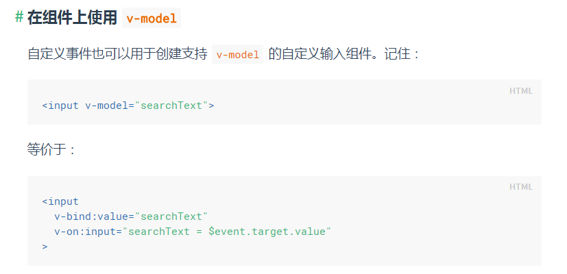

# 要回顾

1. form 是一个神奇的东西 里面的 submit的 触发 需要 深入学习
2. vue的 .prevent 是为了 处理 取消默认行为的
3. 其实上面的叫做vue的事件修饰符 ： 修饰符可以串联
 - `stop`: 阻止事件继续传播
 - `prevent`: 提交事件不再重载页面
 - `self`: 只有event.target是当前元素自身时才会触发
 ```js
<!-- 滚动事件的默认行为 (即滚动行为) 将会立即触发 -->
<!-- 而不会等待 `onScroll` 完成  -->
<!-- 这其中包含 `event.preventDefault()` 的情况 -->
<div v-on:scroll.passive="onScroll">...</div>
 ```
 >这个 .passive 修饰符尤其能够提升移动端的性能。
 4. transition 动画
 5. vue的实际也是单向绑定。
